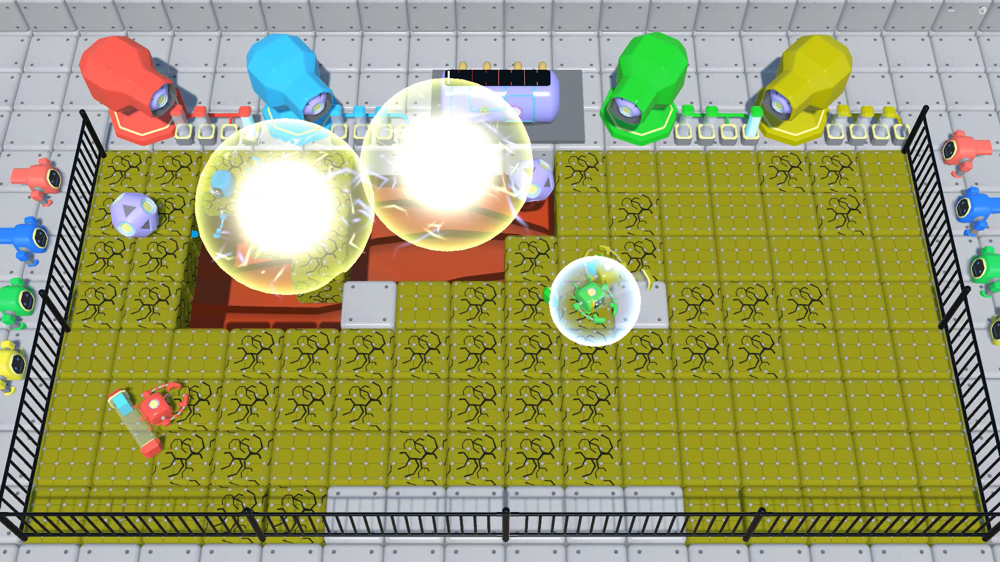
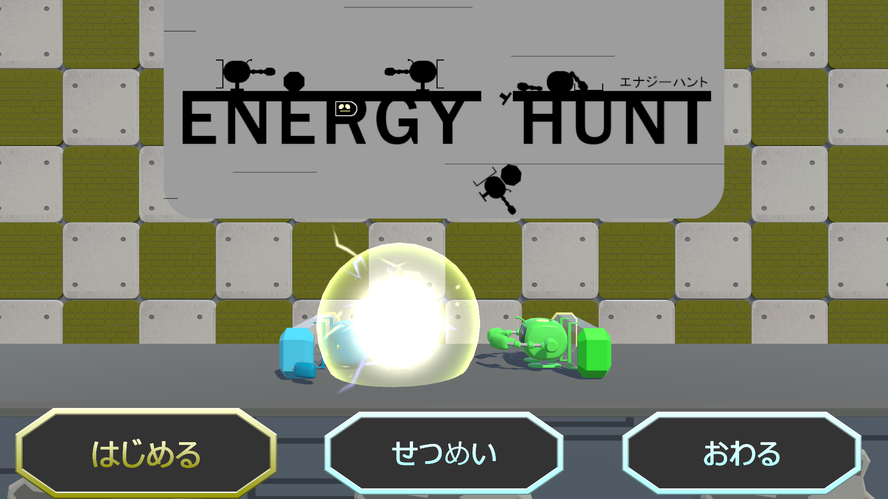
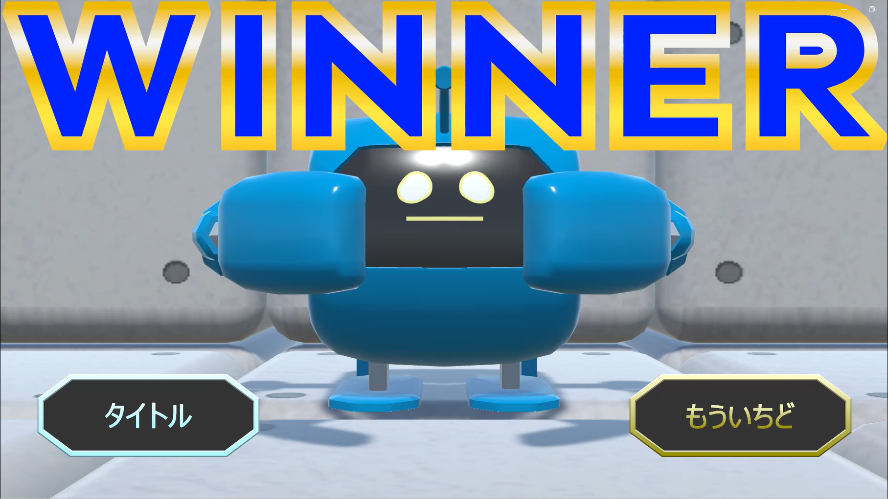

# EnergyHunt

## ゲーム画面

## ファイル構成
* [Unityデータ](./ProjectData/)
* [ビルドデータ](./BuildData/)

## 概要

## ジャンル
4人対戦パーティーゲーム

## プラットフォーム
WindowsPC

## Unityバージョン
Unity 2022.3.24f1

## 制作期間
2か月半

## 制作人数
5人(プログラマー3人、デザイナー2人)

## ゲームルール
エネルギーコアを持ってバッテリーにエネルギーを溜める。
エネルギーコアを投げて放電させ、相手を倒してエネルギーを奪う。
満タンになったバッテリーを大砲にセット、大砲を発射し相手を倒して勝利。

## 担当プログラムファイル
* [プレイヤーの制御](./ProjectData/Assets/Scripts/PlayerController.cs)
* [コアの取得](./ProjectData/Assets/Scripts/TakeBomb.cs)
* [コアのキャッチ](./ProjectData/Assets/Scripts/CatchScript.cs)
* [バリアの制御](./ProjectData/Assets/Scripts/BarrierScript.cs)
* [コアの制御](./ProjectData/Assets/Scripts/BombScript.cs)
* [地面の破壊、復活](./ProjectData/Assets/Scripts/BlockScript.cs)
* [大砲を打ち出す演出](./ProjectData/Assets/Scripts/ShootBullet.cs)
* [ポーズ画面](./ProjectData/Assets/Scripts/PoseScript.cs)

## 制作中の問題とその解決

### コントローラーの接続問題
今回の制作ではPS4コントローラー2つ、ホリコン2つを使うことになりました。
制作初期はInputManagerで制御を行っていたのですが、コントローラーの接続順によって
コントローラー制御が上手くいかないという問題が発生しました。

#### 問題の解決
解決策として、InputManagerからInputSystemへの変更を行いました。
これにより一つの設定で複数のコントローラーに対応でき、接続順に関係なく、想定した
動きができるようになりました。

### 操作ボタンが多い問題
このゲームでは、投げる、取る、バッテリーセット、バリアの4つのアクションが
あり、4つのボタンを割り当てていました。
それにより操作が複雑化し、分かりにくくなってしまいました。

#### 問題の解決
同時に起きない動作を同じボタンにし、必ず行う動作を自動化することで、使用ボタンを
4つから2つに減らすことができました。